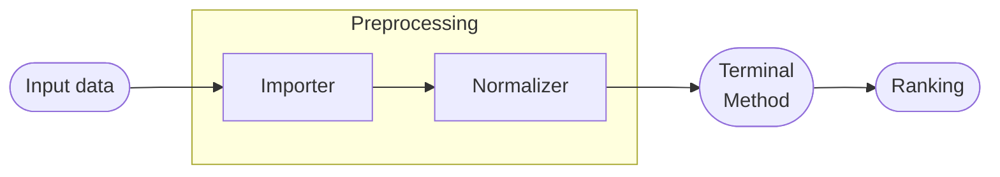

# Architecture

Every operation inside the pipeline is an `IPipelineStep`. Steps are divided into two categories:

| Role | Examples | Runs | How many |
|---|---|---|---|
| **Preprocessing** | Importer, Normalizer | In registration order | Any number |
| **Terminal** | Decision method | Always last | Exactly one |



## Preprocessing steps

Preprocessing steps form a chain. Each step receives the output of the previous one, transforms it, and passes the result forward. The pipeline doesn't inspect what a step does — it just calls them in sequence.

A correct setup looks like this:

```csharp
PipelineBuilder
    .Create()
    .WithData(d => d
        .FromCsv(csv => csv
            .WithPath("data.csv")
            .WithSeparator(',')))
    .AddProcessingStep(new NormalizationStepBuilder()
        .WithMethod(NormalizationMethod.MinMax)
        .Build())
    .Build();
```

### What happens if you flip the order?

```csharp
// ❌ Wrong order — normalizer runs before the data has been loaded
PipelineBuilder
    .Create()
    .Build();
```

The normalizer receives an empty or uninitialized matrix because the importer hasn't run yet. The pipeline won't stop you from registering steps in this order — it has no semantic understanding of what each step does.

:::warning
The pipeline will not warn you about step ordering. Getting it wrong is likely to throw at execution time — but the error will come from inside a step, not from the pipeline itself.
:::

## Terminal step

The terminal step is the decision method. It always runs last, after all preprocessing steps have completed, and receives the fully prepared matrix.

The method is not registered in the builder — it's passed directly to `Execute()` along with the data:

```csharp
var result = pipeline.Execute(data, method);
```

This means the same pipeline can run with different methods without rebuilding.
